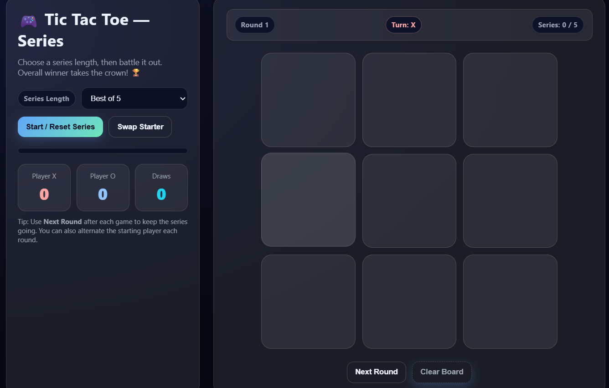

# 🎮 Tic Tac Toe – Series Mode

A modern and interactive Tic Tac Toe game built using **HTML, CSS, and JavaScript**. Unlike the classic single-match version, this game supports **Best of 3, 5, 7, 9, or custom-length series**, allowing players to compete across multiple rounds and determine an overall champion.

## ✨ Features

- 🎯 Classic Tic Tac Toe gameplay
- 🏆 Best of 3, 5, 7, 9, or custom series length
- 🔄 Automatic round progression
- 👥 Two-player mode (X vs O)
- 📊 Live scoreboard tracking wins and draws
- 🎮 Alternate starting player between rounds
- 📈 Series progress indicator
- 🎉 Winner highlighting and notifications
- 📱 Fully responsive design
- 🎨 Modern glassmorphism UI

## 🚀 Live Demo

Add your deployed Vercel link here:

```text
https://your-project.vercel.app
```

## 📂 Project Structure

```text
Tic-Tac-Toe/
│
├── index.html
├── style.css
├── script.js
└── README.md
```

## 🛠️ Technologies Used

- HTML5
- CSS3
- JavaScript (ES6)

## ▶️ Running Locally

1. Clone the repository

```bash
git clone https://github.com/MrVk-239/Tic-Tac-Toe.git
```

2. Open the project folder

```bash
cd Tic-Tac-Toe
```

3. Launch the application

Simply open `index.html` in your browser

**OR**

Use VS Code Live Server:

- Install the Live Server extension
- Right-click `index.html`
- Click **Open with Live Server**

## 🎮 How to Play

1. Select a series length.
2. Start a new series.
3. Players take turns placing X and O.
4. Win rounds to earn points.
5. Continue through all rounds.
6. The player with the most wins at the end becomes the series champion.

## 📸 Screenshots

### Game Board



## 🌟 Future Improvements

- Single-player mode with AI
- Difficulty levels
- Sound effects
- Online multiplayer support
- Player name customization
- Game history tracking

## 👨‍💻 Author

**V Krishna**

GitHub: https://github.com/MrVk-239

## 📄 License

This project is open source and available under the MIT License.